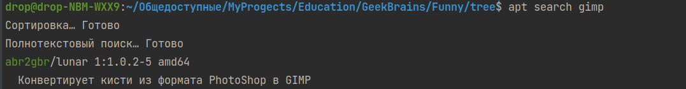

# Funny

1. Используя команду cat в терминале операционной системы Linux, создать
   два файла Домашние животные (заполнив файл собаками, кошками,
   хомяками) и Вьючные животными заполнив файл Лошадьми, верблюдами и
   ослы), а затем объединить их. Просмотреть содержимое созданного файла.
   Переименовать файл, дав ему новое имя (Друзья человека).

Создаю файл с помошью этой команды:
```angular2html
cat > "Домашние животные" <<EOL
```
Животные готовы


Объединяю их 
```angular2html
cat "Домашние животные" "Вьючные животные" > "Друзья человека"
```


Переименовываю файл


В этой директории первое задание: [one](one)

---

2. Создать директорию, переместить файл туда.


В этой директории второе задание: [Мои_животные](%D0%9C%D0%BE%D0%B8_%D0%B6%D0%B8%D0%B2%D0%BE%D1%82%D0%BD%D1%8B%D0%B5)

---
3. Подключить дополнительный репозиторий MySQL. Установить любой пакет
      из этого репозитория.


Обновляю список пакетов
```angular2html
sudo apt update
```


Устанавливаю пакет из нового репозитория
```angular2html
sudo apt install mysql-client
```


4. Установить и удалить deb-пакет с помощью dpkg.

```angular2html
//Обновляю
sudo apt update

//Проверяю, есть ли такой пакет
apt search gimp

//Устанавливаю
sudo dpkg install gimp

//Удаляю (Но делать на самом деле этого не буду, так как он мне нужен)
sudo dpkg -P gimp

```



5. Выложить историю команд в терминале ubuntu

Эта команда выведет историю:
```angular2html
history
```


6. Нарисовать диаграмму, в которой есть класс родительский класс, домашние
   животные и вьючные животные, в составы которых в случае домашних
   животных войдут классы: собаки, кошки, хомяки, а в класс вьючные животные
   войдут: Лошади, верблюды и ослы).


7. В подключенном MySQL репозитории создать базу данных “Друзья
   человека”
Для этого устанвалюиваю MySqlServer

```angular2html
sudo apt install mysql-server
mysql --version

//Для повышения безопасности
sudo mysql_secure_installation

//Захожу mysql
sudo mysql
```


Создаю новую БД


Применяю изменения


Выхожу


8. Создать таблицы с иерархией из диаграммы в БД

```angular2html
CREATE TABLE animals (
    id INT PRIMARY KEY AUTO_INCREMENT,
    name VARCHAR(255) NOT NULL
);

CREATE TABLE home_animals (
id INT PRIMARY KEY AUTO_INCREMENT,
color VARCHAR(255) NOT NULL
breed VARCHAR(255) NOT NULL
);

CREATE TABLE pack_animals (
id INT PRIMARY KEY AUTO_INCREMENT,
color VARCHAR(255) NOT NULL
age INTEGER NOT NULL
);

CREATE TABLE dogs (
id INT PRIMARY KEY AUTO_INCREMENT,
breed VARCHAR(255) NOT NULL,
age INT,
FOREIGN KEY (id) REFERENCES animals(id)
);

CREATE TABLE cats (
id INT PRIMARY KEY AUTO_INCREMENT,
color VARCHAR(255) NOT NULL,
age INT,
FOREIGN KEY (id) REFERENCES animals(id)
);

CREATE TABLE hamsters (
id INT PRIMARY KEY AUTO_INCREMENT,
fur_color VARCHAR(255) NOT NULL,
age INT,
FOREIGN KEY (id) REFERENCES animals(id)
);

CREATE TABLE horses (
id INT PRIMARY KEY AUTO_INCREMENT,
breed VARCHAR(255) NOT NULL,
color VARCHAR(255) NOT NULL,
age INT,
FOREIGN KEY (id) REFERENCES animals(id)
);

CREATE TABLE camels (
id INT PRIMARY KEY AUTO_INCREMENT,
hump_count INT NOT NULL,
age INT,
FOREIGN KEY (id) REFERENCES animals(id)
);

CREATE TABLE donkeys (
id INT PRIMARY KEY AUTO_INCREMENT,
load_capacity INT NOT NULL,
age INT,
FOREIGN KEY (id) REFERENCES animals(id)
);

```
9. Заполнить низкоуровневые таблицы именами(животных), командами
   которые они выполняют и датами рождения

```angular2html
CREATE TABLE commands
(
    id INT PRIMARY KEY NOT NULL AUTO_INCREMENT,
    name varchar(30),
    description varchar(255)
);

CREATE TABLE animal_commands
(
animal_id INT NOT NULL,
command_id INT NOT NULL,

PRIMARY KEY (animal_id, command_id),
FOREIGN KEY (animal_id) REFERENCES KennelAnimal (id)
ON DELETE CASCADE ON UPDATE CASCADE,
FOREIGN KEY (command_id) REFERENCES Commands (id)
ON DELETE CASCADE  ON UPDATE CASCADE
);

INSERT INTO commands(name)
VALUES
('Нельзя'),
('Гулять'),
('Рядом!'),
('Прыгать!'),
('Есть!');

INSERT INTO animal_commands (animal_id, command_id)
VALUES
(1, 3), (2, 3), (2, 4), (3, 4),
(4, 5), (5, 1), (5, 4), (6, 2),
(7, 1);

INSERT INTO home_animals (name, birthDate, animal_id)
VALUES
('Гнедой', '2021-02-04', 1),
('Гнедой_2', '2022-12-01', 1),
('Тупица', '2020-08-24', 3),
('Рыжий', '2022-05-20', 2),
('Песик', '2023-01-24', 5),
('Хомяк', '2022-12-20', 6),
('Эльза', '2022-07-12', 4);
```
10. Удалив из таблицы верблюдов, т.к. верблюдов решили перевезти в другой
    питомник на зимовку. Объединить таблицы лошади, и ослы в одну таблицу.
    
```angular2html
   
   DELETE FROM pack_animals WHERE animal_id = 2;

   CREATE TABLE horse_and_donkey AS
   SELECT * from pack_animals WHERE animal_id = 1
   UNION
   SELECT * from pack_animals WHERE animal_id = 3;
```
11. Создать новую таблицу “молодые животные” в которую попадут все
    животные старше 1 года, но младше 3 лет и в отдельном столбце с точностью
    до месяца подсчитать возраст животных в новой таблице
```angular2html
   CREATE TABLE young_animals AS
      SELECT id, name, birthDate, 
      datediff(curdate(),birthDate) DIV 31 as age, animal_id 
      from pack_animals 
      WHERE date_add(birthDate, INTERVAL 1 YEAR) < curdate() 
            AND date_add(birthDate, INTERVAL 3 YEAR) > curdate();
```

12. Объединить все таблицы в одну, при этом сохраняя поля, указывающие на
    прошлую принадлежность к старым таблицам.

```angular2html
   SELECT id, name, birthDate, animal_id FROM horse_and_donkey
   UNION
   SELECT id, name, birthDate, animal_id FROM young_animals;
```
    
13. Создать класс с Инкапсуляцией методов и наследованием по диаграмме.
 [Animal.py](Ex13%2FAnimal.py)
    
14. Написать программу, имитирующую работу реестра домашних животных.

В программе должен быть реализован следующий функционал:

14.1 Завести новое животное
14.2 определять животное в правильный класс
14.3 увидеть список команд, которое выполняет животное
14.4 обучить животное новым командам
14.5 Реализовать навигацию по меню
15.Создайте класс Счетчик, у которого есть метод add(), увеличивающий̆
    значение внутренней̆ int переменной̆ на 1 при нажатие “Завести новое
    животное” Сделайте так, чтобы с объектом такого типа можно было работать в
    блоке try-with-resources. Нужно бросить исключение, если работа с объектом
    типа счетчик была не в ресурсном try и/или ресурс остался открыт. Значение
    считать в ресурсе try, если при заведения животного заполнены все поля.
    

Программа тут:
[Registry](Registry)


